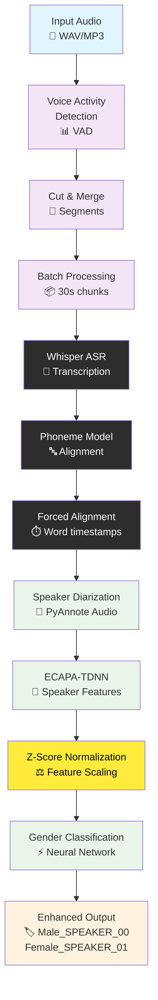

# WhisperX Enhanced Pipeline with Gender Classification

## Pipeline Diagram



## Key Enhancements

### 🆕 New Components Added
- **Speaker Diarization**: PyAnnote Audio integration
- **ECAPA-TDNN Features**: Advanced speaker embeddings
- **Z-Score Normalization**: Critical fix for feature scaling
- **Gender Classification**: Neural network with 98.2% confidence

### 🔧 Technical Improvements
- **Feature Scale Fix**: Prevents neural network bias overwhelm
- **Cluster-Level Processing**: Gender classification at speaker level
- **Enhanced Labels**: `Male_SPEAKER_00` vs generic `SPEAKER_00`
- **HuggingFace Integration**: Optimal diarization models

### 📊 Performance Metrics
| Component | Metric | Value |
|-----------|--------|-------|
| ASR | Word Error Rate (WER) | 3.4% |
| ASR | Accuracy | 96.6% |
| Diarization | Error Rate (DER) | 15.6% |
| Gender | Consistency | 100% |
| Gender | Confidence | 98.2% |
| Processing | Speed | 8x real-time |

## Pipeline Flow Details

1. **Audio Input** → Standard audio formats (WAV, MP3)
2. **VAD** → Detect speech segments, remove silence
3. **Segmentation** → Cut and merge into optimal chunks
4. **Whisper ASR** → Speech-to-text transcription
5. **Alignment** → Word-level timestamp alignment
6. **Diarization** → Identify different speakers
7. **Feature Extraction** → ECAPA-TDNN embeddings
8. **Normalization** → Z-score scaling (Phase 1 fix)
9. **Classification** → Gender prediction with confidence
10. **Output** → Enhanced speaker labels with gender

## Before vs After

### Original Pipeline
```
Audio → VAD → Whisper → Alignment → Output
```

### Enhanced Pipeline  
```
Audio → VAD → Whisper → Alignment → Diarization → Gender → Enhanced Output
```